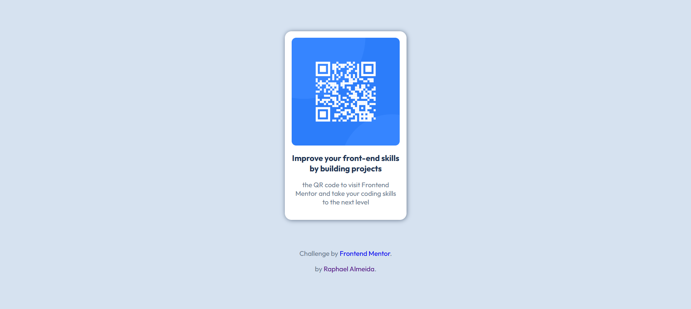
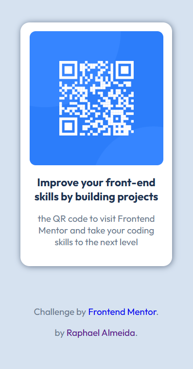

# Frontend Mentor - QR code component solution

This is a solution to the [QR code component challenge on Frontend Mentor](https://www.frontendmentor.io/challenges/qr-code-component-iux_sIO_H). Frontend Mentor challenges help you improve your coding skills by building realistic projects.

## Table of contents

- [Screenshot](#screenshot)
- [Links](#links)
- [Built with](#built-with)
- [What I learned](#what-i-learned)
- [Author](#author)

### Screenshot

### Links

- Live WebPage: (https://devraph12.github.io/qr-code-component-main/)

### Built with

- Semantic HTML5 markup
- CSS custom properties
- Flexbox
- Mobile-first workflow

### What I learned

In this little project, I focused on visual understanding about the example and trying to reproduce it on my own, it was also a great moment to practice Flexbox, it is always important to dominate position placement. I also took my time to write good semantic HTML, also focusing on simple clean code, another great feature was to start the project by "Mobile-first workflow" which is great for development for all screen sizes.

## Author

- LinkedIn - [Raphael Almeida](www.linkedin.com/in/raphael-almeida-dev12)
- Frontend Mentor - [@devraph12](https://www.frontendmentor.io/profile/DevRaph12)
